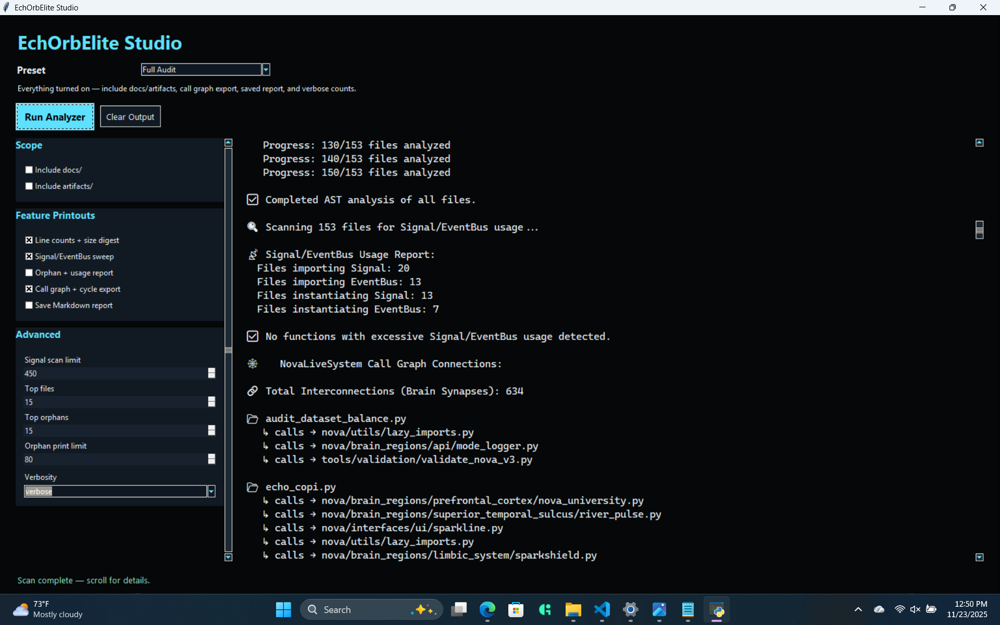

# NovaLiveSystem Runtime & Tooling Architecture

NovaLiveSystem is not just a checkpoint; it is a living system that depends on a trio of runtime tools to keep its biomimetic organs synchronized. EchOrbElite, SparkLine, and EchoCopi each monitor a different axis of the tri-heartbeat (emotional, operational, cognitive). This document explains the role of each tool and its relevance to system integrity.

---

## Overview

- **Purpose:** Surface the observability layer that makes a distributed cognition engine trustworthy. The runtime tools demonstrate that PulseEngine, BridgeEngine, and Nova’s memory orbits are aligned at run time.
- **Scope:** Each section below describes the tool’s role, the telemetry it exposes, and the supporting evidence available in this repository.
- **Artifacts:** Redacted captures live in `NovaLiveSystem-Showcase/screenshots/` with hashes tracked in `manifest.json` so reviewers can verify integrity.

---

## EchOrbElite (EOE)

**Role:** EchOrbElite is the system’s **anatomical scanner**. It performs deep static analysis of the codebase to map `Signal` pathways, detect orphaned brain regions, and verify the structural integrity of the PulseEngine's wiring. It ensures the "nervous system" is fully connected before the system ever wakes up.

**Relevance:** **Validates architectural integrity.** EOE proves that the distributed cognition engine is physically capable of communication. It audits the code to ensure every `Signal` has a destination and every brain region is reachable, preventing "lobotomized" states where modules run in isolation.

**Artifact:**

- Screenshot hash: `D578E793C9DE620A18E6F50BA06B95918CD77F8A3ABC666DF71BC9CAEBC16A27` (see `screenshots/manifest.json`).
- Capture date: 2025-11-23. Historical capture showing the HUD used to validate Stage10 heartbeats.

---

## SparkLine Interface

**Role:** SparkLine is the neural interface—Nova’s live console. It is how we drive probes, watch guardrail responses, and yank telemetry on demand.

**Relevance:** Validates probe execution and dataset integrity. Every drift probe, dataset validation, and literal-logit run originates here. Reviewers can see the exact terminal output via redacted captures (`Guardrail Probe Screenshot...`, `Literal Logit Report...`). SparkLine anchors the “prove it” story: prompts on the left, Nova’s disciplined outputs on the right, plus timestamps.

**Key signals:**

- Drift suite execution (`artifacts/tests/calibration/`).
- Dataset validation summaries (`tools/validation/validate_dataset.py`).
- Literal logit diagnostics for telemetry anchors (`tools/analysis/literal_logit_diagnostics.py`).

---

## EchoCopi Continuity Engine

**Role:** EchoCopi is the checksum brainstem. It records every session, validates SHA-256 hashes, and ensures Nova’s memory orbits stay authentic. When a model reset happens, we call `from echo_copi import copi; e.verify_session(...)` to prove the log wasn’t tampered with.

**Relevance:** Provides a tamper-evident ledger. The continuity engine proves “Nova remembers” without exposing RiverPulse internals. It also powers the “My Issues” automation—each GitHub checklist step ties back to an EchoCopi trail entry.

**Artifacts:**

- `artifacts/copilot_evolution/copilot_evolution.json` (summary ledger).
- `artifacts/copilot_evolution/session_*.jsonl` (per-session receipts with SHA-256 verification).
- `echo_copi.py` (implementation reference, including heartbeat verification functions).

---

## References

- `NovaLiveSystem-Showcase/screenshots/manifest.json`
- `logs/sparkline_session_20251123_212216.log`
- `artifacts/copilot_evolution/`
- `docs/PULSE_ECHO_HEARTBEAT_ARCHITECTURE.md`
